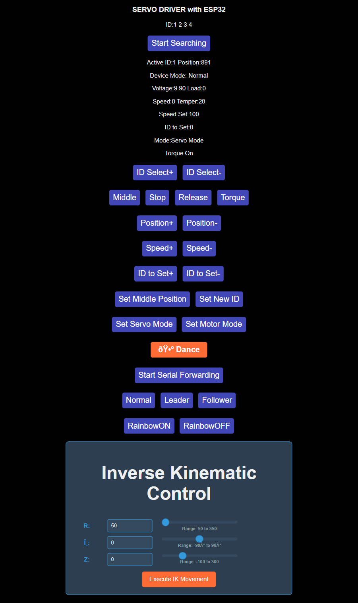

# Autonomous serial manipulator - Robotics Summer project 2025-26

<div align="center">
  
  
  
  </br>
  <div align="center">
    
  </div>
</div> 

---

# Code Folder Documentation - Robotic Arm Project

## Main Components

### 1. Final Code **final_code**

The main implementation of the robotic arm control system[2]. This directory contains the complete ESP32-based control system with the following components:

#### Core Files:
- **`final_code.ino`** - Main Arduino sketch that integrates all functionalities
- **`BOARD_DEV.h`** - Board development and hardware control functions
- **`CONNECT.h`** - WiFi and ESP-NOW communication handling
- **`RGB_CTRL.h`** - RGB LED control functions
- **`STSCTRL.h`** - Servo motor control and management
- **`WEBPAGE.h`** - Web server interface for remote control
- **`PreferencesConfig.h`** - Configuration and preferences management

#### Key Features:
- **Inverse Kinematics Implementation**: Advanced 2-DOF inverse kinematics solver with reachability checking
- **Smooth Movement Control**: Adaptive smooth movement functions for coordinated servo control
- **Web Interface**: ESP32 serves a web interface for remote control
- **Hand Gesture Integration**: Support for hand gesture-based control commands
- **Multi-threading**: FreeRTOS implementation for concurrent operations
- **OLED Display**: Real-time status display on SSD1306 OLED screen
- **RGB LED Feedback**: Visual status indication through RGB LEDs

### 2. Hand Gesture Control **hand gesture code**

Computer vision-based control system that allows users to control the robotic arm through hand gestures[12].

#### Files:
- **`hand_gesture.py`** - Main gesture recognition and control script[12]
- **`HandTrackingModule.py`** - Hand tracking utility module using MediaPipe

#### Functionality:
- **Real-time Hand Detection**: Uses OpenCV and MediaPipe for hand landmark detection
- **Gesture Recognition**: Detects fist gestures for directional control and thumb-index distance for gripper control
- **Wireless Communication**: Sends HTTP requests to the ESP32 web server for robot control
- **Visual Feedback**: Displays hand tracking visualization with FPS counter and grip percentage

### 3. Old Code

Archive of previous implementations and experimental versions:

#### Subdirectories:
- **`blended_movement`** - Early smooth movement implementation
- **`final`** - Previous "final" version with different IK implementation
- **`ik`** - Basic inverse kinematics implementation
- **`ik_from_web`** - Web-controlled inverse kinematics version
- **`old_code`** - Original stepper motor and servo control code

### 4. Utility Files

#### `check_range.cpp`
Standalone C++ utility for validating inverse kinematics solutions. Features:
- **2-DOF IK Solver**: Calculates joint angles for given end-effector positions
- **Reachability Validation**: Checks if target positions are within robot's workspace
  

## Control Interfaces

1. **Web Interface**: HTTP-based control through ESP32 web server
2. **Hand Gesture Control**: Computer vision-based gesture recognition
3. **Serial Control**: Direct UART communication for debugging
4. **ESP-NOW**: Wireless device-to-device communication

## Movement Functions

### Smooth Movement Control
- **`smoothMove3Servos()`**: Synchronized movement of 3 servos with interpolated steps
- **`adaptiveSmoothMove()`**: Adaptive step calculation based on movement distance
- **Coordinated Control**: Ensures smooth, natural arm movements

### Predefined Routines
- **`dance()`**: Demonstration routine with predefined movement
- **`ik()`**: Inverse kinematics-based positioning function

## Usage Examples

### Basic Positioning
```cpp
// Move to specific servo positions
adaptiveSmoothMove(1, 2, 3, 500, 600, 400);
```

### Inverse Kinematics
```cpp
// Position end-effector at coordinates (r=250, z=200, theta=-90°)
ik(250, -90, 200);
```
