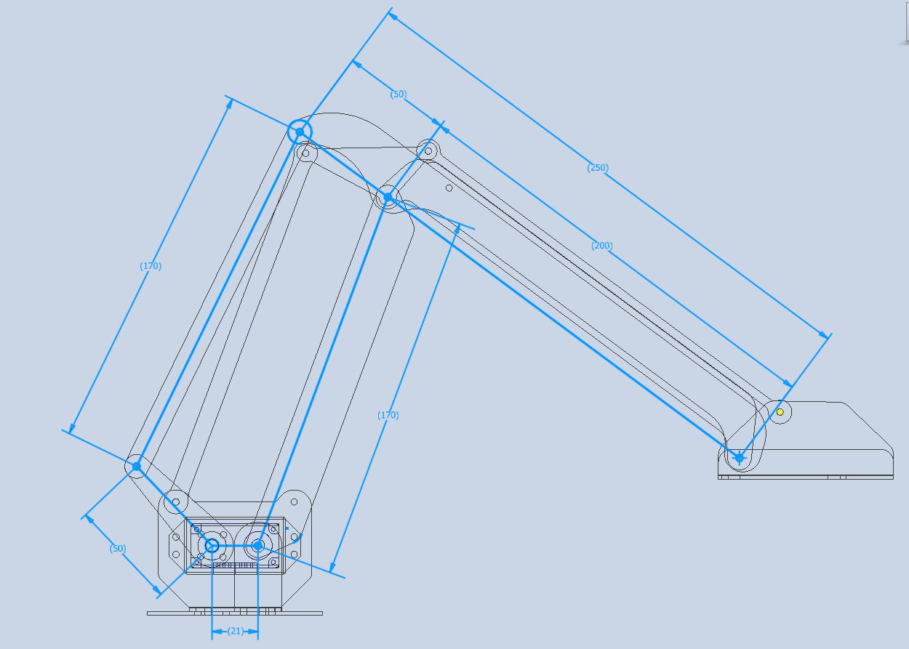

# Autonomous serial manipulator - Robotics Summer project 2025-26 

  
  
  
   
  

    
  

 

## 🧠 Inverse Kinematics

This document outlines the mathematical principles used to solve the inverse kinematics of a robotic arm with three rotational joints, where the end-effector must reach a known point in space while satisfying geometric and directional constraints.

We map the angle  cylindrical coordinate-based controls `[r, θ, z]`

---

### 📐 Problem Setup

We map the angle of rotation of the three joints to cylindrical coordinate-based controls `[r, θ, z]`

We first note that one of the rotational joint i.e. the one at the base, directly maps to θ.

Using this observation, we can essentially reduce the 3-dimensional problem to a 2-dimensional one. 
- **Joint 1**: base servo, maps directly to **θ**
- **Joint 2**: link 1, characterised by **α**
- **Joint 3**: link 2, characterized by **β**

We model the robotic arm as two circular reach zones:
- **Link 1**: Length = 170 units, rotates by angle **α**
- **Link 2**: Length = 50 units, rotates by angle **β**

The end-effector is located at a known point **(r, z)** in a 2-D plane that is at an angle of **θ** . We aim to find all valid pairs (α, β) such that the arm configuration reaches this point and satisfies a directional constraint.

---

### 🧮 Circle Equations

Each link defines a circle:

### Circle 1 (Link 1 endpoint):

$(x − 170cosα)² + (y − 170sinα)² = 50²$

### Circle 2 (Link 2 endpoint):

$(x + 21 + 50cosβ)^2 + (y - 50cosβ)^2 = 170^2$

These equations represent the geometric constraints on a joint indicated by **X** in the figure.

## 🔁 Circle-Circle Intersection

To find the intersection points of the two circles:

Let’s denote:
- $x_0 = 170cosα$
- $y_0 = 170sinα$
- $x_1 = -21-50cosβ$
- $y_1 = 50cosβ$

1. Compute the distance d between centers:
   

   $d = \sqrt{(x_1 - x_0)^2 + (y_1 - y_0)^2}$

2. Compute intermediate values:
   - $a = \frac{r_0^2 - r_1^2 + d^2}{2d}$
  
   - $h = \sqrt{r_0^2 - a^2}$

3. Compute base point:

   $x_2 = x_0 + a \cdot \frac{x_1 - x_0}{d}, \quad y_2 = y_0 + a \cdot \frac{y_1 - y_0}{d}$

4. Compute intersection points:
   
   $x = x_2 \pm h \cdot \frac{y_1 - y_0}{d}, \quad y = y_2 \mp h \cdot \frac{x_1 - x_0}{d}$

---

## 🎯 End Effector Coordinates

To find the coordinate of the end effector, we apply a simple ratio with the coordinates of two already known points.

$$\frac{r - x_0}{r - x} = \frac{z - y_0}{z - y} = \frac{4}{5}$$

This ensures the vector from the end effector to the center of Link 1 is aligned with the vector to the intersection point, scaled by a factor of 0.8.

---

## 📏 Angular Filtering

After computing valid (α, β) pairs, we filter them based on physical constraints:

- $α ∈ [-90^\circ, 90^\circ]$
- $β ∈ [-30^\circ, 90^\circ]$

This ensures the arm operates within its mechanical limits.

## 🔄 Numerical Search

We use a brute-force search over (α, β) space:
- Step size: 0.01 radians
- For each pair, compute intersection points
- Check directional constraint
- Filter by angular bounds

## 📦 Output

The final output is a list of valid (α, β) pairs (in degrees), each corresponding to a feasible arm configuration that reaches the target point.